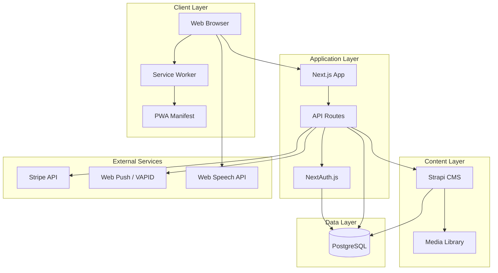
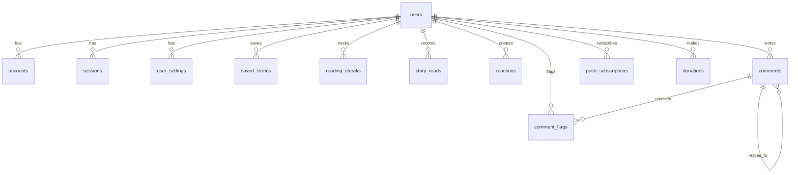

# Technical Design Document: Hang In There - Daily Inspiration

## Overview

Hang In There is a Progressive Web Application (PWA) that delivers one curated, verified story of human resilience each day. The platform combines a modern React/Next.js frontend with a headless CMS (Strapi) for editorial content management, browser-native push notifications, and optional donation processing via Stripe.

### Core User Flows

1. **Guest Reading**: Users can browse and read all stories without authentication
2. **Daily Story Consumption**: Users receive one new story daily at a consistent time
3. **Notification Opt-In**: Users enable browser push notifications for daily story alerts
4. **Account Creation**: Users create accounts to save stories and customize preferences
5. **Story Discovery**: Users search and filter the archive by theme, keyword, or date
6. **Community Engagement**: Registered users react to and comment on stories
7. **Audio Listening**: Users play audio read-aloud versions of stories
8. **Donation**: Users support the platform through optional one-time or recurring donations

### Design Principles

- **Accessibility First**: WCAG 2.1 AA compliance from day one
- **Privacy by Default**: Minimal data collection, no tracking pixels, GDPR/CCPA compliant
- **Progressive Enhancement**: Core reading experience works without JavaScript
- **Hosting Agnostic**: No vendor-specific APIs; portable across hosting providers
- **Open Source First**: All components except Stripe are MIT-licensed and self-hostable

## Architecture

### System Architecture

The application follows a JAMstack architecture with server-side rendering for SEO and performance:



### Technology Stack

| Layer | Technology | Purpose |
|-------|-----------|---------|
| Frontend Framework | React 18 + Next.js 14 | SSR, routing, PWA support |
| Styling | Tailwind CSS 3 | Utility-first CSS, responsive design |
| CMS | Strapi 4 | Headless CMS for editorial workflow |
| Authentication | NextAuth.js 4 | OAuth + email/password auth |
| Database | PostgreSQL 15 | Relational data storage |
| Push Notifications | Web Push API + VAPID | Browser-native notifications |
| Audio | Web Speech API | Text-to-speech (Phase 1) |
| Payments | Stripe | Donation processing |
| Analytics | Plausible | Privacy-first analytics |

### Hosting Strategy

**Phase 1 (Development)**: Vercel Hobby (free, non-commercial)
- Zero-config Next.js deployment
- Preview environments per PR
- Global CDN
- Constraints: Non-commercial use only, 100GB bandwidth/month

**Phase 2 (Launch)**: Vercel Pro ($20/month)
- Commercial use permitted
- Unlimited bandwidth
- Production-ready performance
- Trigger: When donation flow goes live

**Phase 3 (Scale)**: Self-hosted VPS + Coolify
- Hetzner/DigitalOcean VPS ($6-12/month)
- Coolify for deployment management
- Cloudflare CDN (free tier)
- No code changes required from Phase 2

### Data Flow

**Story Publication Flow**:
1. Editor creates/edits story in Strapi CMS
2. Story scheduled for publication date
3. Cron job checks for stories to publish at configured time
4. Published story triggers push notification to subscribed users
5. Story appears in feed and archive

**User Interaction Flow**:
1. User visits site (guest or authenticated)
2. Next.js SSR renders story feed from Strapi API
3. User interactions (save, react, comment) hit Next.js API routes
4. API routes validate auth and write to PostgreSQL
5. Client updates optimistically with revalidation

## Components and Interfaces

### Frontend Components

#### Core Layout Components

**AppShell**
- Persistent navigation header with logo, search, account menu
- Footer with support link, accessibility statement, privacy policy
- Responsive breakpoints: mobile (<640px), tablet (640-1024px), desktop (>1024px)

**StoryFeed**
- Displays stories in reverse chronological order
- Daily story pinned at top with visual distinction
- Infinite scroll with pagination fallback
- Loading states and error boundaries

**StoryCard**
- Headline (max 12 words)
- Narrative text (250-400 words)
- Subject name and identifier
- Theme tag badge
- Source attribution link
- Publication date
- Action buttons: Share, Save, Audio
- Reaction counts
- Comment count

#### Story Interaction Components

**AudioPlayer**
- Play/pause button
- Progress bar with seek capability
- Playback speed selector (0.75x, 1x, 1.25x, 1.5x)
- Keyboard accessible (Space = play/pause, Arrow keys = seek)
- Uses Web Speech API in Phase 1

**ReactionBar**
- Curated emoji set: ❤️ (love), ✊ (resilience), 🌱 (growth), 😢 (moved)
- Click to toggle reaction
- Display count for each reaction
- Optimistic UI updates

**CommentSection**
- Threaded comments (max depth: 2)
- Comment input with character limit (500 chars)
- Community guidelines displayed above input
- Flag button on each comment
- Moderator actions (hide, delete) for admin users
- Pagination for comments (20 per page)

#### User Account Components

**AuthModal**
- Email/password login form
- OAuth buttons (Google, Apple)
- Sign up / sign in toggle
- Password reset flow
- Accessible form validation

**UserSettings**
- Notification preferences (on/off, time of day)
- Theme filter preferences
- Streak counter visibility toggle
- Account deletion option

**SavedStories**
- Grid/list view of bookmarked stories
- Filter by theme
- Search within saved stories
- Remove from saved list

#### Discovery Components

**StoryArchive**
- Search bar with keyword search
- Theme filter dropdown
- Date range picker
- Sort options (newest, oldest, random)
- Pagination (20 stories per page)
- "Random Story" button

**SearchResults**
- Highlighted search terms in results
- Result count
- Empty state with suggestions

#### Donation Components

**DonationPage**
- Mission statement and cost transparency
- Suggested donation tiers ($3, $5, $10/month or one-time)
- Custom amount input
- Stripe payment form
- Community Wall opt-in checkbox
- Thank you confirmation

**CommunityWall**
- Grid of donor names (first name, last initial)
- Chronological or random order
- Privacy-respecting display

### Backend API Routes

#### Story API

```typescript
// GET /api/stories/daily
// Returns today's story for the user's timezone
interface DailyStoryResponse {
  story: Story;
  userHasSaved: boolean;
  userReaction: ReactionType | null;
}

// GET /api/stories
// Returns paginated story list with filters
interface StoriesQuery {
  page?: number;
  limit?: number;
  theme?: string;
  search?: string;
  dateFrom?: string;
  dateTo?: string;
  random?: boolean;
}

// GET /api/stories/:id
// Returns single story with full details
interface StoryResponse {
  story: Story;
  comments: Comment[];
  reactions: ReactionCounts;
  userHasSaved: boolean;
  userReaction: ReactionType | null;
}
```

#### User API

```typescript
// POST /api/user/save
// Save or unsave a story
interface SaveStoryRequest {
  storyId: string;
  action: 'save' | 'unsave';
}

// GET /api/user/saved
// Get user's saved stories
interface SavedStoriesResponse {
  stories: Story[];
  total: number;
}

// PUT /api/user/settings
// Update user preferences
interface UserSettings {
  notificationEnabled: boolean;
  notificationTime: string; // HH:MM format
  themeFilters: string[];
  streakVisible: boolean;
}

// GET /api/user/streak
// Get user's reading streak
interface StreakResponse {
  currentStreak: number;
  longestStreak: number;
  lastReadDate: string;
}
```

#### Interaction API

```typescript
// POST /api/reactions
// Add or remove a reaction
interface ReactionRequest {
  storyId: string;
  reactionType: 'heart' | 'fist' | 'seedling' | 'tear';
  action: 'add' | 'remove';
}

// POST /api/comments
// Create a comment
interface CreateCommentRequest {
  storyId: string;
  content: string;
  parentId?: string; // For replies
}

// POST /api/comments/:id/flag
// Flag a comment for moderation
interface FlagCommentRequest {
  reason: string;
}

// DELETE /api/comments/:id
// Delete own comment or moderate as admin
```

#### Notification API

```typescript
// POST /api/notifications/subscribe
// Subscribe to push notifications
interface SubscribeRequest {
  subscription: PushSubscription; // Web Push API object
  timezone: string;
  preferredTime: string; // HH:MM format
}

// DELETE /api/notifications/unsubscribe
// Unsubscribe from push notifications

// POST /api/notifications/test
// Send test notification to user
```

#### Donation API

```typescript
// POST /api/donations/create-checkout
// Create Stripe checkout session
interface CheckoutRequest {
  amount: number;
  frequency: 'once' | 'monthly';
  displayOnWall: boolean;
  displayName?: string;
}

// POST /api/donations/webhook
// Stripe webhook handler for payment events

// GET /api/donations/community-wall
// Get list of donors for Community Wall
interface CommunityWallResponse {
  donors: Array<{
    displayName: string;
    donatedAt: string;
  }>;
}
```

### Strapi CMS Schema

#### Story Content Type

```typescript
interface Story {
  id: string;
  headline: string; // max 12 words
  narrative: string; // 250-400 words
  subjectName: string;
  subjectIdentifier: string; // e.g., "fisherwoman, Brazil"
  theme: 'grit' | 'love' | 'community' | 'environment' | 'balance' | 'care';
  sourceUrl: string;
  sourceAttribution: string;
  publishDate: Date;
  scheduledDate: Date;
  status: 'draft' | 'scheduled' | 'published';
  featuredImage?: Media;
  commentsEnabled: boolean;
  createdBy: AdminUser;
  updatedBy: AdminUser;
  createdAt: Date;
  updatedAt: Date;
}
```

#### Editorial Workflow

- Editors create stories in Strapi admin panel
- Stories move through draft → scheduled → published states
- Minimum 30-story backlog maintained
- Scheduled publication via cron job
- Version history tracked automatically by Strapi

## Data Models

### PostgreSQL Schema

#### Users Table

```sql
CREATE TABLE users (
  id UUID PRIMARY KEY DEFAULT gen_random_uuid(),
  email VARCHAR(255) UNIQUE NOT NULL,
  email_verified BOOLEAN DEFAULT FALSE,
  name VARCHAR(255),
  image TEXT,
  created_at TIMESTAMP DEFAULT NOW(),
  updated_at TIMESTAMP DEFAULT NOW()
);

CREATE INDEX idx_users_email ON users(email);
```

#### Accounts Table (NextAuth)

```sql
CREATE TABLE accounts (
  id UUID PRIMARY KEY DEFAULT gen_random_uuid(),
  user_id UUID NOT NULL REFERENCES users(id) ON DELETE CASCADE,
  type VARCHAR(50) NOT NULL,
  provider VARCHAR(50) NOT NULL,
  provider_account_id VARCHAR(255) NOT NULL,
  refresh_token TEXT,
  access_token TEXT,
  expires_at INTEGER,
  token_type VARCHAR(50),
  scope TEXT,
  id_token TEXT,
  session_state TEXT,
  created_at TIMESTAMP DEFAULT NOW(),
  updated_at TIMESTAMP DEFAULT NOW(),
  UNIQUE(provider, provider_account_id)
);

CREATE INDEX idx_accounts_user_id ON accounts(user_id);
```

#### Sessions Table (NextAuth)

```sql
CREATE TABLE sessions (
  id UUID PRIMARY KEY DEFAULT gen_random_uuid(),
  session_token VARCHAR(255) UNIQUE NOT NULL,
  user_id UUID NOT NULL REFERENCES users(id) ON DELETE CASCADE,
  expires TIMESTAMP NOT NULL,
  created_at TIMESTAMP DEFAULT NOW(),
  updated_at TIMESTAMP DEFAULT NOW()
);

CREATE INDEX idx_sessions_user_id ON sessions(user_id);
CREATE INDEX idx_sessions_session_token ON sessions(session_token);
```

#### Verification Tokens Table (NextAuth)

```sql
CREATE TABLE verification_tokens (
  identifier VARCHAR(255) NOT NULL,
  token VARCHAR(255) UNIQUE NOT NULL,
  expires TIMESTAMP NOT NULL,
  PRIMARY KEY (identifier, token)
);
```

#### User Settings Table

```sql
CREATE TABLE user_settings (
  user_id UUID PRIMARY KEY REFERENCES users(id) ON DELETE CASCADE,
  notification_enabled BOOLEAN DEFAULT FALSE,
  notification_time TIME DEFAULT '08:00:00',
  timezone VARCHAR(50) DEFAULT 'UTC',
  theme_filters TEXT[], -- Array of theme preferences
  streak_visible BOOLEAN DEFAULT TRUE,
  created_at TIMESTAMP DEFAULT NOW(),
  updated_at TIMESTAMP DEFAULT NOW()
);
```

#### Saved Stories Table

```sql
CREATE TABLE saved_stories (
  id UUID PRIMARY KEY DEFAULT gen_random_uuid(),
  user_id UUID NOT NULL REFERENCES users(id) ON DELETE CASCADE,
  story_id VARCHAR(255) NOT NULL, -- Strapi story ID
  saved_at TIMESTAMP DEFAULT NOW(),
  UNIQUE(user_id, story_id)
);

CREATE INDEX idx_saved_stories_user_id ON saved_stories(user_id);
CREATE INDEX idx_saved_stories_story_id ON saved_stories(story_id);
```

#### Reading Streak Table

```sql
CREATE TABLE reading_streaks (
  user_id UUID PRIMARY KEY REFERENCES users(id) ON DELETE CASCADE,
  current_streak INTEGER DEFAULT 0,
  longest_streak INTEGER DEFAULT 0,
  last_read_date DATE,
  created_at TIMESTAMP DEFAULT NOW(),
  updated_at TIMESTAMP DEFAULT NOW()
);
```

#### Story Reads Table

```sql
CREATE TABLE story_reads (
  id UUID PRIMARY KEY DEFAULT gen_random_uuid(),
  user_id UUID REFERENCES users(id) ON DELETE CASCADE,
  story_id VARCHAR(255) NOT NULL,
  read_at TIMESTAMP DEFAULT NOW(),
  read_duration INTEGER, -- seconds
  UNIQUE(user_id, story_id, DATE(read_at))
);

CREATE INDEX idx_story_reads_user_id ON story_reads(user_id);
CREATE INDEX idx_story_reads_story_id ON story_reads(story_id);
CREATE INDEX idx_story_reads_read_at ON story_reads(read_at);
```

#### Reactions Table

```sql
CREATE TABLE reactions (
  id UUID PRIMARY KEY DEFAULT gen_random_uuid(),
  user_id UUID NOT NULL REFERENCES users(id) ON DELETE CASCADE,
  story_id VARCHAR(255) NOT NULL,
  reaction_type VARCHAR(20) NOT NULL CHECK (reaction_type IN ('heart', 'fist', 'seedling', 'tear')),
  created_at TIMESTAMP DEFAULT NOW(),
  UNIQUE(user_id, story_id, reaction_type)
);

CREATE INDEX idx_reactions_story_id ON reactions(story_id);
CREATE INDEX idx_reactions_user_id ON reactions(user_id);
```

#### Comments Table

```sql
CREATE TABLE comments (
  id UUID PRIMARY KEY DEFAULT gen_random_uuid(),
  user_id UUID NOT NULL REFERENCES users(id) ON DELETE CASCADE,
  story_id VARCHAR(255) NOT NULL,
  parent_id UUID REFERENCES comments(id) ON DELETE CASCADE,
  content TEXT NOT NULL CHECK (LENGTH(content) <= 500),
  status VARCHAR(20) DEFAULT 'visible' CHECK (status IN ('visible', 'hidden', 'flagged', 'deleted')),
  created_at TIMESTAMP DEFAULT NOW(),
  updated_at TIMESTAMP DEFAULT NOW()
);

CREATE INDEX idx_comments_story_id ON comments(story_id);
CREATE INDEX idx_comments_user_id ON comments(user_id);
CREATE INDEX idx_comments_parent_id ON comments(parent_id);
CREATE INDEX idx_comments_status ON comments(status);
```

#### Comment Flags Table

```sql
CREATE TABLE comment_flags (
  id UUID PRIMARY KEY DEFAULT gen_random_uuid(),
  comment_id UUID NOT NULL REFERENCES comments(id) ON DELETE CASCADE,
  flagged_by UUID NOT NULL REFERENCES users(id) ON DELETE CASCADE,
  reason TEXT NOT NULL,
  status VARCHAR(20) DEFAULT 'pending' CHECK (status IN ('pending', 'reviewed', 'dismissed')),
  created_at TIMESTAMP DEFAULT NOW(),
  reviewed_at TIMESTAMP,
  reviewed_by UUID REFERENCES users(id),
  UNIQUE(comment_id, flagged_by)
);

CREATE INDEX idx_comment_flags_comment_id ON comment_flags(comment_id);
CREATE INDEX idx_comment_flags_status ON comment_flags(status);
```

#### Push Subscriptions Table

```sql
CREATE TABLE push_subscriptions (
  id UUID PRIMARY KEY DEFAULT gen_random_uuid(),
  user_id UUID NOT NULL REFERENCES users(id) ON DELETE CASCADE,
  endpoint TEXT NOT NULL UNIQUE,
  p256dh TEXT NOT NULL,
  auth TEXT NOT NULL,
  timezone VARCHAR(50) DEFAULT 'UTC',
  preferred_time TIME DEFAULT '08:00:00',
  created_at TIMESTAMP DEFAULT NOW(),
  updated_at TIMESTAMP DEFAULT NOW()
);

CREATE INDEX idx_push_subscriptions_user_id ON push_subscriptions(user_id);
```

#### Donations Table

```sql
CREATE TABLE donations (
  id UUID PRIMARY KEY DEFAULT gen_random_uuid(),
  user_id UUID REFERENCES users(id) ON DELETE SET NULL,
  stripe_payment_id VARCHAR(255) UNIQUE NOT NULL,
  stripe_customer_id VARCHAR(255),
  amount INTEGER NOT NULL, -- cents
  currency VARCHAR(3) DEFAULT 'USD',
  frequency VARCHAR(20) NOT NULL CHECK (frequency IN ('once', 'monthly')),
  status VARCHAR(20) NOT NULL CHECK (status IN ('pending', 'succeeded', 'failed', 'refunded')),
  display_on_wall BOOLEAN DEFAULT FALSE,
  display_name VARCHAR(100),
  created_at TIMESTAMP DEFAULT NOW(),
  updated_at TIMESTAMP DEFAULT NOW()
);

CREATE INDEX idx_donations_user_id ON donations(user_id);
CREATE INDEX idx_donations_stripe_payment_id ON donations(stripe_payment_id);
CREATE INDEX idx_donations_display_on_wall ON donations(display_on_wall) WHERE display_on_wall = TRUE;
```

### Data Relationships



### Data Validation Rules

**Story Content (Strapi)**:
- Headline: 1-12 words, required
- Narrative: 250-400 words, required
- Subject name: required, max 255 chars
- Theme: one of enum values, required
- Source URL: valid URL, required
- Scheduled date: future date, required for scheduled stories

**User Input**:
- Email: valid email format, unique
- Comment content: 1-500 characters
- Display name: 1-100 characters, alphanumeric + spaces
- Notification time: HH:MM format, 00:00-23:59

**Business Rules**:
- Users can save each story only once
- Users can have only one reaction type per story
- Comments can be nested max 2 levels deep
- Flagged comments are hidden until reviewed
- Reading streak increments only once per day
- Donations must be minimum $1 USD


## Correctness Properties

*A property is a characteristic or behavior that should hold true across all valid executions of a system—essentially, a formal statement about what the system should do. Properties serve as the bridge between human-readable specifications and machine-verifiable correctness guarantees.*

### Property Reflection

After analyzing all acceptance criteria, I identified several areas of redundancy:

1. **Story Card Rendering**: Criteria 5.1.1-5.1.6 all test that specific fields appear in the rendered story card. These can be combined into a single comprehensive property that validates all required fields are present.

2. **Settings Persistence**: Criteria 5.4.4 (notification preferences) and 5.2.2 (preferred delivery time) both test round-trip persistence of user settings. These can be combined into a general settings persistence property.

3. **Access Control**: Multiple criteria test that certain features require authentication (5.6.3 for comments, 5.4.1 for guest access). These can be combined into properties about authentication requirements.

4. **Accessibility**: Criteria 5.9.1-5.9.5 all test WCAG compliance aspects. While each is important, they can be grouped into comprehensive accessibility properties rather than separate tests for each criterion.

The following properties represent the unique, non-redundant validation requirements after reflection:

### Property 1: Story Card Completeness

*For any* published story, the rendered story card must contain all required fields: headline (1-12 words), narrative (250-400 words), subject name, subject identifier, theme tag, source attribution link, and publication date.

**Validates: Requirements 5.1.1, 5.1.2, 5.1.3, 5.1.4, 5.1.5, 5.1.6**

### Property 2: Daily Story Consistency

*For any* given date, all users querying the daily story must receive the same story regardless of their timezone, authentication status, or preferences.

**Validates: Requirements 5.2.3**

### Property 3: User Settings Round-Trip

*For any* user settings object (notification preferences, preferred time, theme filters, streak visibility), saving the settings and then retrieving them must return an equivalent settings object.

**Validates: Requirements 5.2.2, 5.4.4**

### Property 4: Notification Rate Limiting

*For any* user with notifications enabled, the system must never send more than one notification within any 24-hour period, regardless of how many times the notification job runs.

**Validates: Requirements 5.3.3**

### Property 5: Guest Access to Stories

*For any* published story, unauthenticated (guest) users must be able to read the full story content without being required to create an account.

**Validates: Requirements 5.4.1**

### Property 6: Saved Stories Round-Trip

*For any* story that a user saves, querying that user's saved stories list must include that story until the user explicitly unsaves it.

**Validates: Requirements 5.4.3**

### Property 7: Reading Streak Calculation

*For any* sequence of story reads by a user, the current streak must equal the number of consecutive days (ending with today) on which the user read at least one story.

**Validates: Requirements 5.4.6**

### Property 8: Theme Filter Accuracy

*For any* theme filter applied to the story archive, all returned stories must have that theme tag, and no stories with that theme tag should be excluded from the results.

**Validates: Requirements 5.4.5**

### Property 9: Archive Accessibility

*For any* story that has been published (status = 'published'), that story must be retrievable from the public archive regardless of authentication status.

**Validates: Requirements 5.5.1**

### Property 10: Search Result Relevance

*For any* search query (keyword, theme, or date range), all returned stories must match the search criteria, and the results must be ordered by publication date (newest first by default).

**Validates: Requirements 5.5.2**

### Property 11: Pagination Consistency

*For any* page number in the story archive, the response must contain at most 20 stories, and requesting the same page multiple times must return the same stories in the same order (assuming no new publications).

**Validates: Requirements 5.5.3**

### Property 12: Random Story Variability

*For any* sequence of random story requests, the probability of receiving the same story twice in a row must be less than 1/N where N is the total number of published stories (assuming N > 1).

**Validates: Requirements 5.5.4**

### Property 13: Reaction Uniqueness

*For any* user and story combination, a user can have at most one active reaction of each type, and adding the same reaction type twice must be idempotent (no duplicate reactions created).

**Validates: Requirements 5.6.1, 5.6.2**

### Property 14: Comment Authentication Requirement

*For any* attempt to post a comment, the request must fail with an authentication error if the user is not authenticated, and must succeed if the user is authenticated and the comment is valid.

**Validates: Requirements 5.6.3**

### Property 15: Comment Content Filtering

*For any* comment containing content from a prohibited content list (slurs, hate speech), the comment must be rejected before being stored in the database.

**Validates: Requirements 5.6.5**

### Property 16: Flagged Comment Visibility

*For any* comment that has been flagged by any user, that comment must not be visible to non-moderator users until a moderator reviews and clears the flag.

**Validates: Requirements 5.6.6**

### Property 17: Comment Threading Depth Limit

*For any* comment at depth 2 (a reply to a reply), attempting to reply to that comment must be rejected, ensuring maximum thread depth never exceeds 2.

**Validates: Requirements 5.6.7**

### Property 18: Donation Amount Flexibility

*For any* donation amount greater than or equal to the minimum ($1 USD), the Stripe checkout session must be created successfully, regardless of whether the amount matches a suggested tier.

**Validates: Requirements 5.8.3**

### Property 19: Donor Content Parity

*For any* two users (one donor, one non-donor), both must see identical story content, features, and access permissions—donations must not grant content privileges.

**Validates: Requirements 5.8.5**

### Property 20: Community Wall Opt-In Round-Trip

*For any* donor who opts in to display on the Community Wall, their display name must appear on the wall, and for any donor who opts out, their name must not appear.

**Validates: Requirements 5.8.6**

### Property 21: Semantic HTML Structure

*For any* story content rendered in the application, all headings must use proper heading tags (h1-h6), all lists must use list tags (ul/ol/li), and all interactive elements must use appropriate semantic HTML or ARIA roles.

**Validates: Requirements 5.9.1**

### Property 22: Keyboard Navigation Completeness

*For any* interactive element in the application (buttons, links, form inputs, audio controls), that element must be reachable and operable using only keyboard input (Tab, Enter, Space, Arrow keys).

**Validates: Requirements 5.9.2, 5.10.4**

### Property 23: Color Contrast Compliance

*For any* text element in the application, the contrast ratio between the text color and its background must meet WCAG AA standards (4.5:1 for normal text, 3:1 for large text).

**Validates: Requirements 5.9.3**

### Property 24: Text Scaling Resilience

*For any* page in the application, increasing the browser's text size to 200% must not cause text to be cut off, overlap, or become unreadable.

**Validates: Requirements 5.9.4**

### Property 25: Image Alternative Text

*For any* image element in the application, the element must have an alt attribute that is either descriptive (for content images) or empty (for decorative images).

**Validates: Requirements 5.9.5**

### Property 26: Audio Player Availability

*For any* story page, an audio player with play, pause, and progress controls must be present and functional.

**Validates: Requirements 5.10.1, 5.10.2**

### Property 27: Audio Playback Speed Control

*For any* audio player, the user must be able to select playback speeds of 0.75x, 1x, 1.25x, and 1.5x, and the audio must play at the selected speed.

**Validates: Requirements 5.10.3**

### Property 28: Audio Playback Navigation Behavior

*For any* audio player that is currently playing, navigating to a different page must pause the playback.

**Validates: Requirements 5.10.5**

### Property 29: HTTPS Transport Security

*For any* HTTP request made by the application in production, the request must use HTTPS protocol with TLS 1.2 or higher.

**Validates: Requirements 7.5.3**

### Property 30: Payment Data Isolation

*For any* database query against the application's PostgreSQL database, the result set must never contain credit card numbers, CVV codes, or full card data—all payment data must be stored exclusively in Stripe.

**Validates: Requirements 7.5.4**

## Error Handling

### Error Categories

The application handles errors across several categories:

**1. Authentication Errors**
- Invalid credentials
- Expired sessions
- OAuth provider failures
- Email verification failures

**2. Authorization Errors**
- Unauthenticated access to protected resources
- Insufficient permissions for moderation actions
- Attempt to modify another user's data

**3. Validation Errors**
- Invalid input formats (email, URLs, dates)
- Content length violations (headline too long, comment too short)
- Required fields missing
- Invalid enum values (theme, reaction type)

**4. External Service Errors**
- Strapi CMS unavailable
- Stripe API failures
- Push notification delivery failures
- Web Speech API not supported

**5. Database Errors**
- Connection failures
- Constraint violations (unique, foreign key)
- Transaction deadlocks
- Query timeouts

**6. Rate Limiting Errors**
- Too many requests from single IP
- Too many failed login attempts
- Comment spam detection

### Error Handling Strategies

**Client-Side Error Handling**

```typescript
// API call wrapper with error handling
async function apiCall<T>(
  endpoint: string,
  options?: RequestInit
): Promise<Result<T, ApiError>> {
  try {
    const response = await fetch(endpoint, {
      ...options,
      headers: {
        'Content-Type': 'application/json',
        ...options?.headers,
      },
    });

    if (!response.ok) {
      const error = await response.json();
      return {
        success: false,
        error: {
          code: error.code || 'UNKNOWN_ERROR',
          message: error.message || 'An unexpected error occurred',
          statusCode: response.status,
        },
      };
    }

    const data = await response.json();
    return { success: true, data };
  } catch (error) {
    return {
      success: false,
      error: {
        code: 'NETWORK_ERROR',
        message: 'Unable to connect to the server',
        statusCode: 0,
      },
    };
  }
}
```

**Error Display Patterns**

- **Inline Errors**: Form validation errors appear next to the relevant field
- **Toast Notifications**: Transient errors (save failed, network error) appear as dismissible toasts
- **Error Boundaries**: React error boundaries catch rendering errors and display fallback UI
- **Empty States**: Missing data displays helpful empty states with actions
- **Retry Mechanisms**: Failed requests include retry buttons with exponential backoff

**Server-Side Error Handling**

```typescript
// API route error handler
export function handleApiError(error: unknown): NextResponse {
  // Log error for monitoring
  console.error('API Error:', error);

  if (error instanceof ValidationError) {
    return NextResponse.json(
      { code: 'VALIDATION_ERROR', message: error.message, fields: error.fields },
      { status: 400 }
    );
  }

  if (error instanceof AuthenticationError) {
    return NextResponse.json(
      { code: 'AUTHENTICATION_ERROR', message: 'Authentication required' },
      { status: 401 }
    );
  }

  if (error instanceof AuthorizationError) {
    return NextResponse.json(
      { code: 'AUTHORIZATION_ERROR', message: 'Insufficient permissions' },
      { status: 403 }
    );
  }

  if (error instanceof NotFoundError) {
    return NextResponse.json(
      { code: 'NOT_FOUND', message: error.message },
      { status: 404 }
    );
  }

  if (error instanceof RateLimitError) {
    return NextResponse.json(
      { code: 'RATE_LIMIT_EXCEEDED', message: 'Too many requests' },
      { status: 429 }
    );
  }

  // Generic server error
  return NextResponse.json(
    { code: 'INTERNAL_ERROR', message: 'An unexpected error occurred' },
    { status: 500 }
  );
}
```

### Graceful Degradation

**Progressive Enhancement Approach**:

1. **Core Experience**: Story reading works without JavaScript (SSR)
2. **Enhanced Experience**: JavaScript adds interactivity (reactions, comments, audio)
3. **Offline Support**: Service worker caches stories for offline reading
4. **Feature Detection**: Check for Web Speech API, Push API support before using

**Fallback Strategies**:

- **Push Notifications**: If browser doesn't support Web Push, offer email digest option
- **Audio Read-Aloud**: If Web Speech API unavailable, hide audio player gracefully
- **OAuth**: If OAuth provider fails, email/password auth still available
- **Images**: All images have alt text and load with lazy loading
- **Strapi CMS**: If CMS unavailable, serve cached stories from CDN

### Monitoring and Alerting

**Error Tracking**:
- Client-side errors logged to error tracking service (e.g., Sentry)
- Server-side errors logged with structured logging
- Failed API calls tracked with endpoint, status code, and error type
- Database errors monitored for patterns (connection pool exhaustion, slow queries)

**Alert Thresholds**:
- Error rate > 5% of requests: Warning
- Error rate > 10% of requests: Critical
- Database connection failures: Immediate alert
- Stripe webhook failures: Immediate alert
- Push notification delivery rate < 90%: Warning

## Testing Strategy

### Dual Testing Approach

The application uses both unit testing and property-based testing to ensure comprehensive coverage:

**Unit Tests**: Focus on specific examples, edge cases, and integration points
- Specific user flows (login, save story, post comment)
- Edge cases (empty states, boundary values, error conditions)
- Component rendering with specific props
- API endpoint responses with specific inputs
- Integration between components

**Property-Based Tests**: Verify universal properties across all inputs
- Universal properties that hold for all valid inputs
- Comprehensive input coverage through randomization
- Minimum 100 iterations per property test
- Each test references its design document property

Together, these approaches provide comprehensive coverage: unit tests catch concrete bugs in specific scenarios, while property tests verify general correctness across the input space.

### Testing Stack

| Layer | Technology | Purpose |
|-------|-----------|---------|
| Unit Testing | Jest + React Testing Library | Component and function testing |
| Property Testing | fast-check | Property-based testing for JavaScript/TypeScript |
| E2E Testing | Playwright | Full user flow testing |
| API Testing | Supertest | API endpoint testing |
| Accessibility Testing | axe-core + jest-axe | Automated WCAG compliance |
| Visual Regression | Percy or Chromatic | UI consistency testing |

### Property-Based Test Configuration

All property-based tests must:
- Run minimum 100 iterations (configured in fast-check)
- Include a comment tag referencing the design property
- Use appropriate generators for input data
- Have clear failure messages

**Example Property Test**:

```typescript
import fc from 'fast-check';

/**
 * Feature: hang-in-there-daily-inspiration
 * Property 6: Saved Stories Round-Trip
 * 
 * For any story that a user saves, querying that user's saved stories list
 * must include that story until the user explicitly unsaves it.
 */
describe('Property 6: Saved Stories Round-Trip', () => {
  it('should persist saved stories in user archive', async () => {
    await fc.assert(
      fc.asyncProperty(
        fc.record({
          userId: fc.uuid(),
          storyId: fc.string({ minLength: 1, maxLength: 255 }),
        }),
        async ({ userId, storyId }) => {
          // Save the story
          await saveStory(userId, storyId);
          
          // Retrieve saved stories
          const savedStories = await getSavedStories(userId);
          
          // Story must be in the list
          expect(savedStories.some(s => s.id === storyId)).toBe(true);
          
          // Cleanup
          await unsaveStory(userId, storyId);
        }
      ),
      { numRuns: 100 }
    );
  });
});
```

### Unit Test Coverage

**Frontend Components**:
- StoryCard: Renders all required fields, handles missing optional fields
- AudioPlayer: Play/pause, speed control, keyboard navigation
- CommentSection: Post comment, reply, flag, pagination
- AuthModal: Login, signup, OAuth, validation errors
- StoryArchive: Search, filter, pagination, empty states

**API Routes**:
- `/api/stories/daily`: Returns correct story for timezone
- `/api/user/save`: Saves and unsaves stories
- `/api/reactions`: Adds and removes reactions, prevents duplicates
- `/api/comments`: Creates comments, enforces depth limit, requires auth
- `/api/notifications/subscribe`: Stores push subscription
- `/api/donations/create-checkout`: Creates Stripe session

**Business Logic**:
- Streak calculation: Consecutive days, resets on missed day
- Comment moderation: Filters prohibited content, hides flagged comments
- Notification scheduling: Respects user timezone and preferred time
- Search relevance: Matches keywords, themes, date ranges

### End-to-End Test Scenarios

1. **Guest User Journey**:
   - Visit homepage → Read daily story → Browse archive → Search stories

2. **New User Onboarding**:
   - Sign up → Enable notifications → Save first story → Read daily story

3. **Engaged User Flow**:
   - Login → Read story → React → Comment → Save → Check streak

4. **Donor Flow**:
   - Login → Navigate to donation page → Complete donation → See name on Community Wall

5. **Audio Listening Flow**:
   - Open story → Play audio → Adjust speed → Navigate away (pauses)

6. **Moderation Flow**:
   - User flags comment → Comment hidden → Moderator reviews → Comment restored/deleted

### Accessibility Testing

**Automated Tests** (jest-axe):
- Run axe-core on all pages and components
- Verify no WCAG AA violations
- Check color contrast ratios
- Validate ARIA attributes

**Manual Testing Checklist**:
- Screen reader navigation (NVDA, JAWS, VoiceOver)
- Keyboard-only navigation through all features
- Text scaling to 200% without loss of function
- High contrast mode compatibility
- Focus indicators visible and clear

### Performance Testing

**Lighthouse CI**:
- Run on every PR
- Enforce minimum scores: Performance ≥ 90, Accessibility = 100, Best Practices ≥ 90, SEO = 100
- Track Core Web Vitals trends

**Load Testing**:
- Simulate 1000 concurrent users reading daily story
- Test notification delivery to 10,000 subscribers
- Verify database query performance under load
- Monitor API response times

### Continuous Integration

**GitHub Actions Workflow**:
1. Lint code (ESLint, Prettier)
2. Type check (TypeScript)
3. Run unit tests (Jest)
4. Run property tests (fast-check)
5. Run E2E tests (Playwright)
6. Run accessibility tests (axe-core)
7. Build application
8. Run Lighthouse CI
9. Deploy preview (Vercel)

**Test Coverage Requirements**:
- Unit test coverage: ≥ 80% for business logic
- Property test coverage: All 30 properties implemented
- E2E test coverage: All critical user flows
- Accessibility: Zero WCAG AA violations

### Test Data Management

**Fixtures**:
- Sample stories with various themes
- User accounts with different permission levels
- Comments with various content (clean, flagged, nested)
- Donation records with different amounts and frequencies

**Generators** (for property tests):
- Story generator: Valid stories with all required fields
- User generator: Users with various settings
- Comment generator: Comments with valid and invalid content
- Date generator: Dates for streak calculations and scheduling

**Database Seeding**:
- Development: Seed with 100 sample stories
- Testing: Fresh database per test suite
- Staging: Production-like data volume (10,000+ stories)

---

**Design Document Version**: 1.0  
**Last Updated**: 2026  
**Status**: Ready for Implementation
